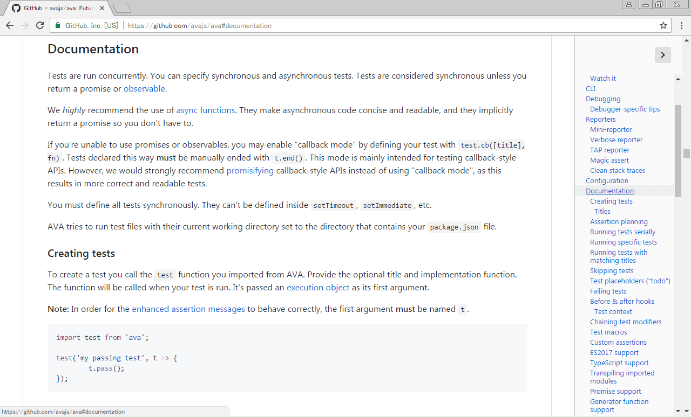
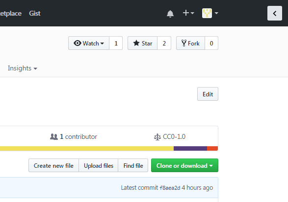

# GitHub Markdown Tabele of Contents
[](https://circleci.com/gh/otariidae/github-markdown-toc)
[](https://codecov.io/gh/otariidae/github-markdown-toc)
[](https://github.com/otariidae/github-markdown-toc/releases)
[](http://creativecommons.org/publicdomain/zero/1.0/)
[](https://standardjs.com/)
[](https://github.com/prettier/prettier)

Chrome extension to show a table of contents on GitHub.  
No more scrolling to read long long long documents.

  
*An example of a long readme with this extension -- AVA: a nice test runner for Node.js*

Works with:
- README on the top pages
- Markdown files
- Wikis
- Commented tags in release pages

## Install
You can install the latest version manually.

1. Download *github-markdown-toc.zip* from [the release page](https://github.com/otariidae/github-markdown-toc/releases) and unzip it.
2. Visit chrome://extensions.
3. Click to check *Developer mode*.
4. Click *Load unpacked extension...*.
5. Select the unzipped directory.

For more info, see [Chrome Extension Get Started](https://developer.chrome.com/extensions/getstarted#unpacked) or [Google Chrome FAQ](https://developer.chrome.com/extensions/faq#faq-dev-01).

## Usage
Click the button on the top right-hand corner to show or hide the table of contents.

Position of the button when logging out:  


Position of the button when logging in:  


## Permissions
```json
"permissions": [
  "https://github.com/*"
]
```
- `https://github.com/*` is used to run scripts on GitHub.

## Recommended environment
- the latest stable version of Google Chrome

## License
CC0  
[](http://creativecommons.org/publicdomain/zero/1.0/)
